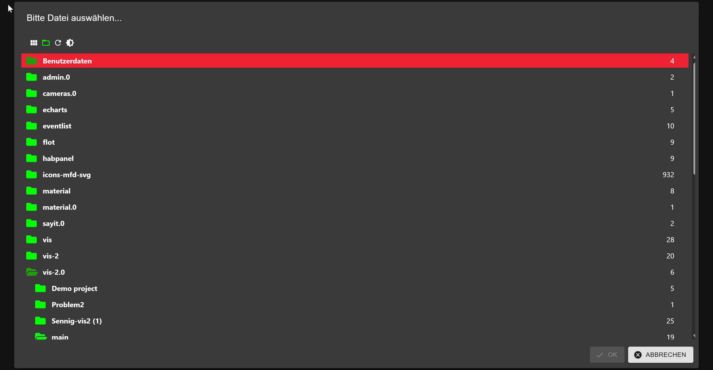

# Web component to select files from ioBroker (admin or web)
This web component enables the implementation of the File Dialog for an ioBroker instance.
It can operate with admin or web instances without requiring authentication. If admin/web has authentication enabled, there is no solution for that yet.

**It can work with admin or web instances only without authentication currently.**

Please note that mixed connections from an HTTP page to a WSS server and vice versa (from HTTPS to WS) do not work in most browsers.



**Important: this project contains both ioBroker dialogs: file selector and Object ID selector.**
So If you want to use both dialogs in one project there is no need to load a `@iobroker/webcomponent-selectid-dialog` package.

How to use Object ID dialog you can find [here](https://github.com/ioBroker/iobroker-webcomponent-selectid-dialog/blob/main/README.md)

Before creating the dialog, the socket file must be loaded. You can find the code [here](https://github.com/ioBroker/ioBroker.ws.client/tree/main/dist/esm).

However, it is always better to load the client part from the ioBroker server.
```html
<script src="http://iobrokerIP:8081/lib/js/socket.io.js"></script>
<!-- or for web server -->
<script src="http://iobrokerIP:8082/lib/js/socket.io.js"></script>

<!-- Load File web component -->
<script src="./iobrokerFile.umd.js"></script>
```

In this scenario, you can ensure that the loaded version is compatible with the backend.
For example, the ioBroker web server might use socket.io or a pure web socket connection.
Therefore, you must ensure that the correct client library is loaded.

How to use with Dynamic creation:
```js
function openFileDialog(selected, cb) {
    window._iobFileDialogOnSelected = function (newId/*, newObj, oldId, oldObj */) {
        let selectDialog = document.getElementById('iob-file');
        if (selectDialog) {
            selectDialog.setAttribute('open', 'false');
        }

        console.log('Selected ' + newId);
        cb && cb(newId);
    };

    if (!window._iobSelectDialog) {
        window._iobSelectDialog = document.createElement('iobroker-file');
        window._iobSelectDialog.setAttribute('id', 'iob-file');
        // Place here the real port of ioBroker admin or web instance
        window._iobSelectDialog.setAttribute('port', window.location.port);
        // Place here the real port of ioBroker admin or web instance
        window._iobSelectDialog.setAttribute('host', window.location.host);
        // Place here the real protocol http: or https:
        window._iobSelectDialog.setAttribute('protocol', window.location.protocol);
        window._iobSelectDialog.setAttribute('language', 'en');
        // This is a name of a global function
        window._iobSelectDialog.setAttribute('onclose', '_iobFileDialogOnSelected');
        window._iobSelectDialog.setAttribute('primary', '#AD1625');
        window._iobSelectDialog.setAttribute('secondary', 'rgb(228, 145, 145)');
        window._iobSelectDialog.setAttribute('paper', 'rgb(243, 243, 243)');
        window._iobSelectDialog.setAttribute('imageprefix', './files/');
        window._iobSelectDialog.setAttribute('selected', selected || '');
        window._iobSelectDialog.setAttribute('token', token || '');
        window._iobSelectDialog.setAttribute('open', 'true');
        document.body.appendChild(window._iobSelectDialog);
    } else {
        window._iobSelectDialog.setAttribute('selected', selected || '');
        window._iobSelectDialog.setAttribute('token', token || '');
        window._iobSelectDialog.setAttribute('open', 'true');
    }
}
openFileDialog('', path => {
    // First folder is adapter name, like "vis-2.0/main/image.png"
    
});
```

Or static:
```html
<iobroker-file
    port="8081"
    host="localhost"
    protocol="http:"
    language="en"
    onclose="_iobFileDialogOnSelected"
    imageprefix="./files/"
    selected="vis-2.0/main/image.png"
    token="{\"access_token\":\"AAA\"}" // optional
    open="true"
></iobroker-file>
```
## Supported attributes

| Attribute            | Type                    | Description                                                                  |
|----------------------|-------------------------|------------------------------------------------------------------------------|
| `imageprefix`        | string                  | Path prefix for images (usually `./` for web and `./files` for admin).       |
| `port`               | number, string          | Port of the ioBroker server.                                                 |
| `protocol`           | `http:`, `https:`       | Protocol for the connection (http or https).                                 |
| `token`              | string                  | Optional authentication token.                                               |
| `host`               | string                  | Hostname or IP address of the ioBroker server.                               |
| `selected`           | string                  | Preselected file or folder.                                                  |
| `onclose`            | string                  | Callback function or function name called on close.                          |
| `open`               | string, boolean         | Opens or closes the dialog.                                                  |
| `language`           | ioBroker.Languages      | Language of the interface.                                                   |
| `theme`              | `light`, `dark`         | Color scheme (light or dark).                                                |
| `primary`            | string                  | Primary color (e.g. for buttons).                                            |
| `secondary`          | string                  | Secondary color.                                                             |
| `paper`              | string                  | Background color.                                                            |
| `selectonlyfolders`  | `true`, `false`         | Only folders can be selected.                                                |
| `filterbytype`       | `images`, `code`, `txt` | Filters by file type (images, code, text).                                   |
| `filterfiles`        | string                  | Comma-separated list of allowed file extensions. Like `png, svg`             |
| `limitpath`          | `true`, `false`         | Restricts selection to a specific path.                                      |
| `showtoolbar`        | `true`, `false`         | Shows the toolbar (default: true).                                           |
| `allowupload`        | `true`, `false`         | Allows uploading files.                                                      |
| `allowdownload`      | `true`, `false`         | Allows downloading files.                                                    |
| `allowcreatefolder`  | `true`, `false`         | Allows creating folders.                                                     |
| `allowdelete`        | `true`, `false`         | Allows deleting files/folders.                                               |
| `allowview`          | `true`, `false`         | Enables tile view (default: true).                                           |
| `zindex`             | string                  | Z-index of the dialog (default: 1300).                                       |
| `showtypeselector`   | `true`, `false`         | Shows the type selector button.                                              |
| `restricttofolder`   | string                  | Restricts selection to a specific folder.                                    |
| `expertmode`         | `true`, `false`         | Enables expert mode.                                                         |
| `showexpertbutton`   | `true`, `false`         | Shows the expert mode button.                                                |
| `allownonrestricted` | `true`, `false`         | Allows selection outside the restricted folder if `restricttofolder` is set. |


There is also a wrapper included in the file `fileHelper.js`, wich lazy loads the ESM module
and provides a promise to open the UI:
```js
  import openFileDialog from '@iobroker/webcomponent-file-dialog/dist/fileHelper.js'
  const id = await openFileDialog({
      port: 8089,
      host: '1.2.3.4',
      protocol: 'http:',
      language: 'en',
      imageprefix: './files',
      selected: '',
      primary: '#AD1625',
      secondary: 'rgb(228, 145, 145)',
      paper: 'rgb(243, 243, 243)',
      token: '{ "access_token": "AAA" }', // optional
  });
```

## Todo
- Replace SelectFile.tsx with `@iobroker/adapter-react-v5` component as admin will be released

## Changelog
<!--
    ### **WORK IN PROGRESS**
-->
### 0.2.1 (2025-09-04)
- (@GermanBluefox) Added select ID dialog to the package

### 0.1.1 (2025-09-04)
- (@GermanBluefox) Initial commit

## License
The MIT License (MIT)

Copyright (c) 2025 Denis Haev <dogafox@gmail.com>

Permission is hereby granted, free of charge, to any person obtaining a copy
of this software and associated documentation files (the "Software"), to deal
in the Software without restriction, including without limitation the rights
to use, copy, modify, merge, publish, distribute, sublicense, and/or sell
copies of the Software, and to permit persons to whom the Software is
furnished to do so, subject to the following conditions:

The above copyright notice and this permission notice shall be included in all
copies or substantial portions of the Software.

THE SOFTWARE IS PROVIDED "AS IS", WITHOUT WARRANTY OF ANY KIND, EXPRESS OR
IMPLIED, INCLUDING BUT NOT LIMITED TO THE WARRANTIES OF MERCHANTABILITY,
FITNESS FOR A PARTICULAR PURPOSE AND NONINFRINGEMENT. IN NO EVENT SHALL THE
AUTHORS OR COPYRIGHT HOLDERS BE LIABLE FOR ANY CLAIM, DAMAGES OR OTHER
LIABILITY, WHETHER IN AN ACTION OF CONTRACT, TORT OR OTHERWISE, ARISING FROM,
OUT OF OR IN CONNECTION WITH THE SOFTWARE OR THE USE OR OTHER DEALINGS IN THE
SOFTWARE.
